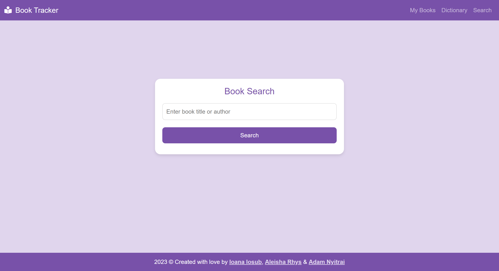
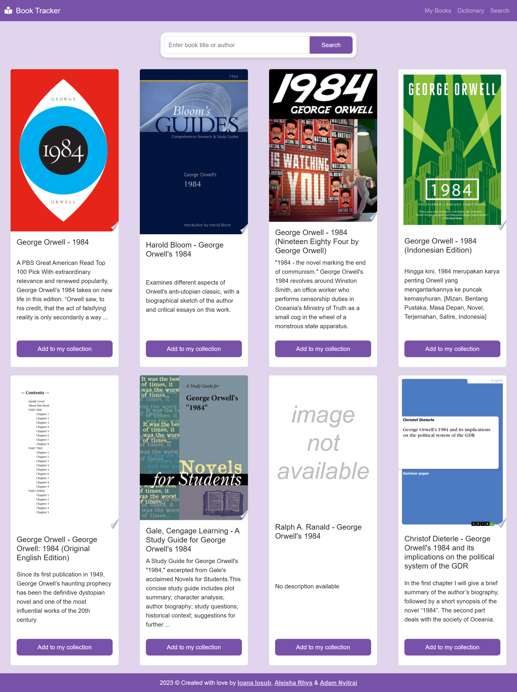
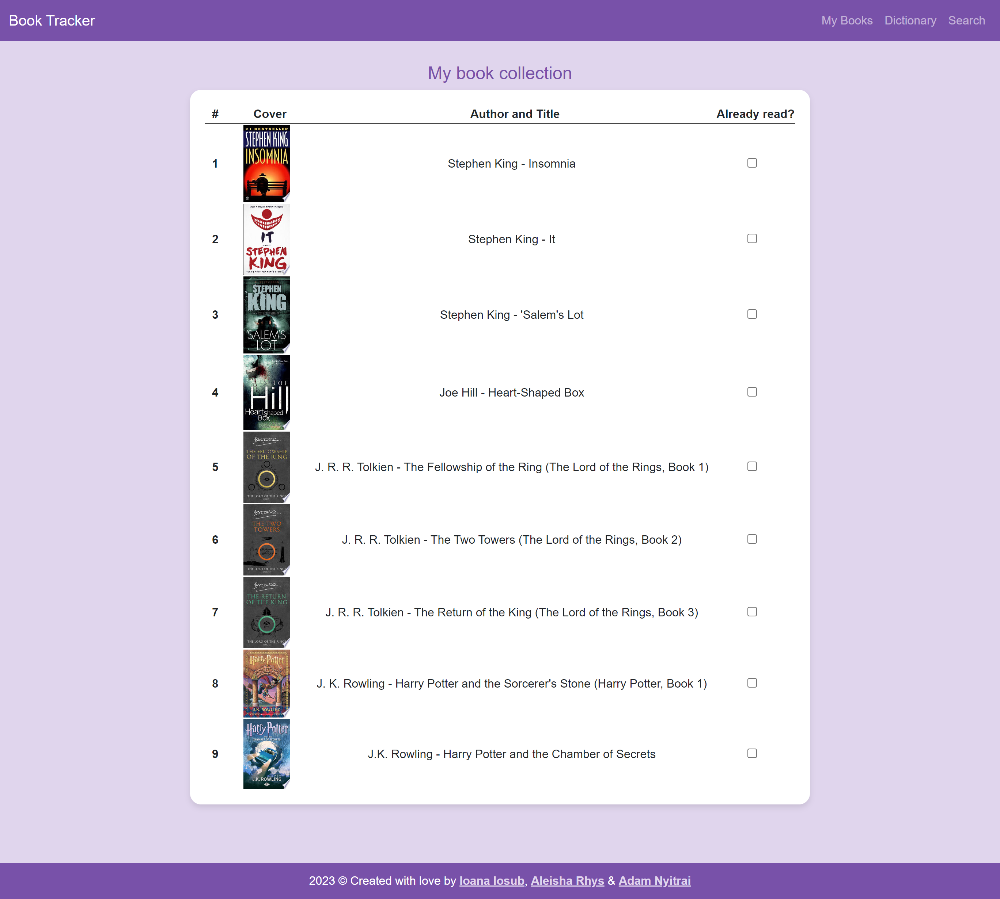
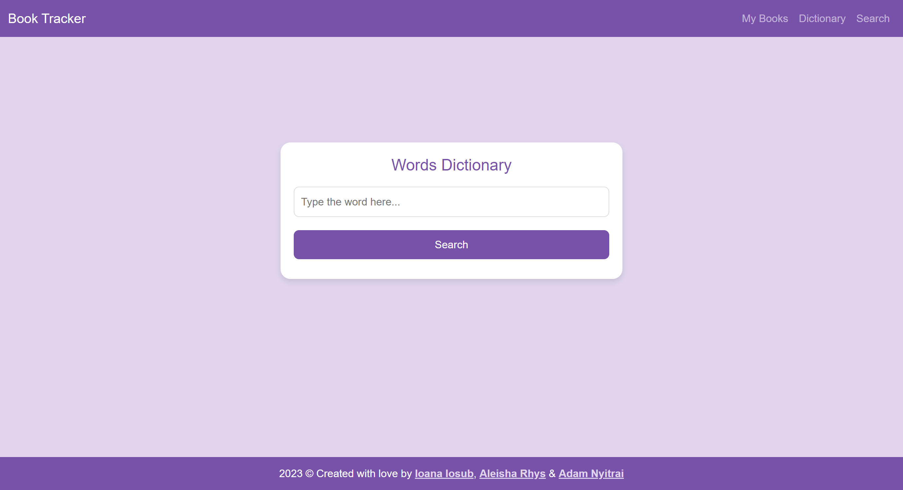
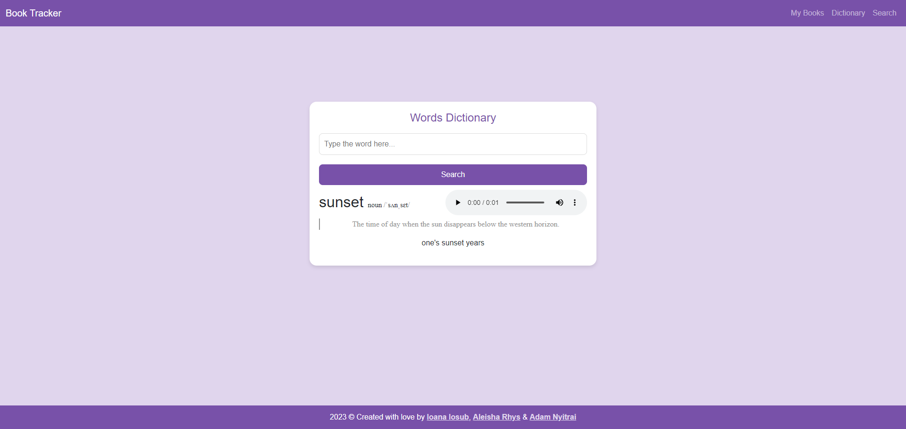

# Book Tracker App

## Description
This book tracker app is an all-in-one solution for book readers. It provides a simple, easy-to-use interface, where you can search for books, and the results are displayed as cards, displaying all necessary information of each book. Books can also be added to a personal collection where you can mark each book that you've already read. But there's more! This pocket librarian also has a built-in disctionary, where you can search for unfamiliar words that you met when you are reading. It displays the meaning of the word and the phonetics, and you can also listen to the correct ponunciation from a pre-recorded audio.

## How to use
### Book search
1. The landing page leads you straight to the book search, where you can type your search terms into the input field. You can search by author, title or you can combine them. Then click on the "Search" button or press Enter.
2. The results will be displayed as cards. Each card displays the cover, author and title, a short description (whichever available). On the bottom of the cards there is a button which if you press it, the book will be added to your personal collection.
3. You can start a new search either using the smaller search bar above the cards, or by clicking "Search" in the navigation bar.

### My Books section
1. You can check your collection of books by clicking on the "My Books" in the navigation barn, then you will see the list of your books in a nice table, each row represents a book with the cover, author and title, and a checkbox.
2. You can mark your books as read once you finished it, so you can easily keep track how many books you've read. It also can help you to pick a new book to read.
3. You don't have to worry about losing your data, your collection will be stored and will be there for you if you are using the same browser.

### Dictionary
1. You can visit the dictionary by clicking the "Dictionary" in the navigation bar, then you will see a search box, similar to the book search on the landing page.
2. Type in the word you're unfamiliar with and either click on the "Search" button, or press Enter.
3. Then below the search form you will see phonetics and the meaning of the word, and an example sentece, alongside with a player (whichever available). You can listen to a pre-recorded audio of the correct ponunciation with this player.

## Screenshots
Screenshot of the book search interface

Screenshot of the book search results

Screenshot of the book collection

Screenshot of the dictionary interface

Screenshot of the dictionary in use

## Links
[Link to the deployed application](https://aleisharhys.github.io/book-tracker-project/)

## Tech stack
- HTML
- CSS
- JavaScript
- [jQuery](https://jquery.com/)
- [Bootstrap](https://getbootstrap.com/docs/5.3/getting-started/introduction/)
- [Google Books API](https://developers.google.com/books/docs/overview)
- [Free Dictionary API](https://dictionaryapi.dev/)

## Other sources
- Storing the state of checkboxes in localStorage (in early stages of development): [Betty Miller's solution on CopyProgramming](https://copyprogramming.com/howto/javascript-save-multiple-checkboxes-with-localstorage)
- How to filter array of objects: [Chickens' solution on StackOverflow](https://stackoverflow.com/a/56757215)
- Image placeholder if no cover picture available (in early stages of development): [No-Image-Placeholder.svg from Wikimedia Commons](https://commons.wikimedia.org/wiki/File:No-Image-Placeholder.svg)
- Replacing cover picture, description, author or title if unavailable from the API: [Milos Rancic's solution on StackOverflow](https://stackoverflow.com/a/55696135)
- Trigger the search button if Enter key is pressed: [Sergey Ilinsky's solution (edited by icedwater) on StackOverflow](https://stackoverflow.com/a/155272)
- Trigger a modal only if there's no input value: [Claudio Redi's solution (edited by unknown user) on StackOverflow](https://stackoverflow.com/a/11404777)
